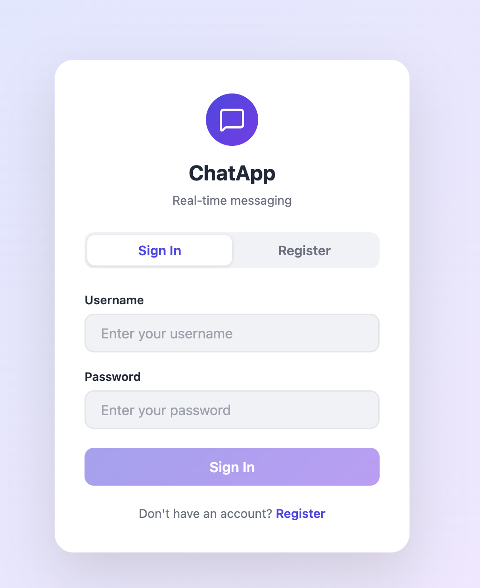
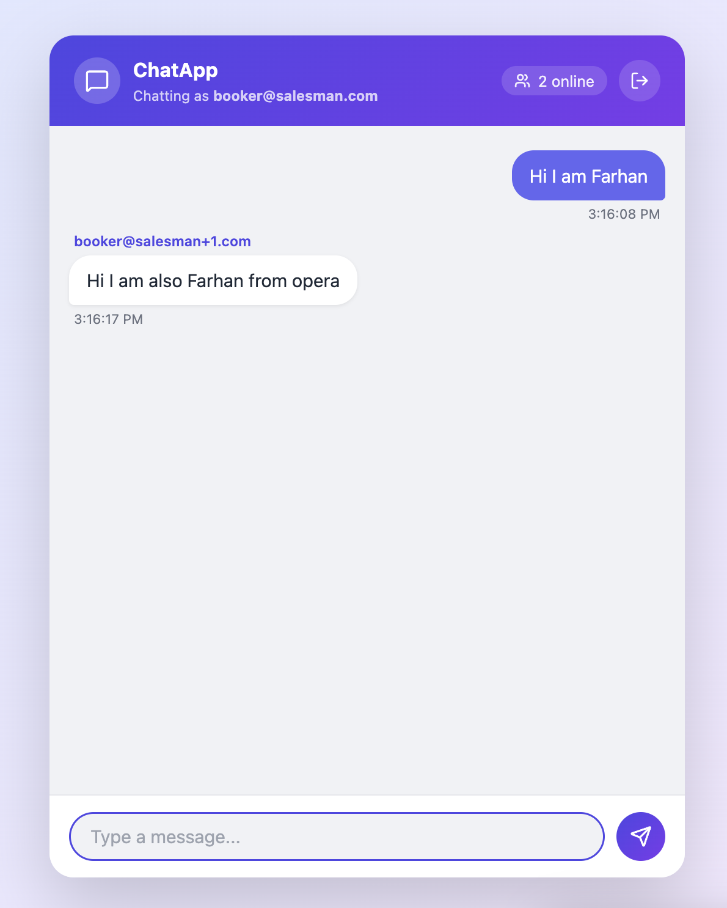

# ChatApp

A full-stack real-time chat application built with React, TypeScript, Node.js, and WebSockets — featuring JWT authentication, live typing indicators, and online presence.

[](https://chat-app-lilac-iota.vercel.app/)
[](https://react.dev)
[](https://typescriptlang.org)
[](https://nodejs.org)

---

## Live Demo

**URL:** https://chat-app-lilac-iota.vercel.app/

> Open the app in **two different browser tabs or windows** to see real-time messaging in action.
---

## Screenshots


| Login Screen | Chat Interface |
|:---:|:---:|
|  |  |

---

## Video Demo

[](https://www.loom.com/share/6383040d3cd2439fb824263ac8c7102f)

---

## Features

- **Real-time messaging** — instant delivery via WebSocket (RFC 6455)
- **Live typing indicator** — see when others are composing a message
- **Online presence** — live count and list of connected users
- **JWT authentication** — register / login with bcrypt-hashed passwords
- **Session persistence** — token stored in `localStorage`, auto-login on revisit
- **Sent vs. received** — messages visually distinguished per session
- **Connection status** — connecting / connected / disconnected banners
- **Rate limiting** — auth endpoints protected against brute-force
- **Responsive design** — works on desktop and mobile

---

## Tech Stack

| Layer      | Technology                                      |
|------------|-------------------------------------------------|
| Frontend   | React 19, TypeScript, Vite                      |
| Backend    | Node.js, Express 5, TypeScript                  |
| Protocol   | WebSocket (`ws` library, RFC 6455)              |
| Auth       | JWT (`jsonwebtoken`) + bcrypt (`bcryptjs`)       |
| Database   | SQLite (`better-sqlite3`)                       |
| Styling    | Plain CSS (no framework)                        |
| Deployment | Vercel (frontend) + Railway (backend)           |

---

## Project Structure

```
ChatApp/
├── chat-client/               # React + Vite frontend
│   ├── src/
│   │   ├── Auth/              # Login & register UI
│   │   ├── Chat/              # Chat UI + WebSocket client
│   │   ├── App.tsx
│   │   └── index.css          # Global styles & CSS variables
│   ├── vercel.json            # SPA rewrite rules
│   └── .env.example
│
└── chat-server/               # Node.js backend
    ├── src/
    │   └── index.ts           # Express + WebSocket server
    ├── Dockerfile
    └── .env.example
```

---

## WebSocket Message Protocol

All messages are JSON. The server never exposes client IDs to other users.

### Server → Client

| Type      | Payload                                              | When                         |
|-----------|------------------------------------------------------|------------------------------|
| `init`    | `{ clientId: string }`                               | On connection                |
| `message` | `{ id, text, timestamp, senderId, senderName }`      | Broadcast on new message     |
| `users`   | `{ count: number, names: string[] }`                 | On any connect / disconnect  |
| `typing`  | `{ username: string, isTyping: boolean }`            | Broadcast to others          |

### Client → Server

| Type      | Payload                          |
|-----------|----------------------------------|
| `message` | `{ text: string }`               |
| `typing`  | `{ isTyping: boolean }`          |

---

## Getting Started

### Prerequisites

- Node.js >= 18
- npm >= 9

### 1. Clone & install

```bash
git clone https://github.com/your-username/ChatApp.git
cd ChatApp

cd chat-server && npm install
cd ../chat-client && npm install
```

### 2. Configure environment

```bash
# chat-server/.env
JWT_SECRET=your-secret-here
PORT=8080
NODE_ENV=development
ALLOWED_ORIGIN=http://localhost:5173
```

```bash
# chat-client/.env.local
VITE_API_URL=http://localhost:8080
VITE_WS_URL=ws://localhost:8080
```

### 3. Run

```bash
# Terminal 1 — backend
cd chat-server && npm run dev

# Terminal 2 — frontend
cd chat-client && npm run dev
```

Open `http://localhost:5173`. Open multiple tabs to chat between them.

---

## Deployment

| Part     | Platform | Notes                                      |
|----------|----------|--------------------------------------------|
| Frontend | Vercel   | Root directory: `chat-client`              |
| Backend  | Railway  | Root directory: `chat-server`, uses Dockerfile |

### Environment variables to set

**Vercel (frontend):**
```
VITE_API_URL=https://your-backend.railway.app
VITE_WS_URL=wss://your-backend.railway.app
```

**Railway (backend):**
```
JWT_SECRET=<long random string>
NODE_ENV=production
ALLOWED_ORIGIN=https://your-app.vercel.app
```

---

## Author

**Farhan Yaseen**
- Portfolio: [farhanyaseen.netlify.app](https://farhanyaseen.netlify.app/)
- LinkedIn: [linkedin.com/in/Farhanyaseen](https://linkedin.com/in/Farhanyaseen)
- Email: farhan.yaseen.se@gmail.com
